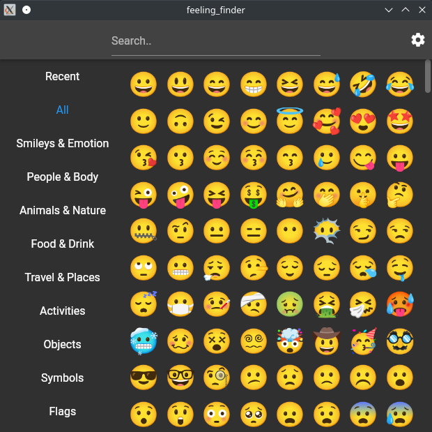

# Feeling Finder

A fast and beautiful app to help convey emotion in text communication.

## Features

- Emojis from the Unicode spec
- Browse emoji categories
- Hover emoji for description
- Start typing to search
- Select emoji with arrow keys
- Press `Enter` or click/tap an emoji to copy to clipboard
- Option to quit after copying to clipboard
- Light & dark theme

 

## Download

**Linux**
  - [Flathub](https://flathub.org/apps/details/codes.merritt.FeelingFinder)
  - [Portable](https://github.com/Merrit/feeling_finder/releases/latest/download/FeelingFinder-Linux-Portable.tar.gz)

**Windows**
- [Installer](https://github.com/Merrit/feeling_finder/releases/latest/download/FeelingFinder-Windows-Installer.msix)
- [Portable](https://github.com/Merrit/feeling_finder/releases/latest/download/FeelingFinder-Windows-Portable.zip)

**Android**
- [Google Play](https://play.google.com/store/apps/details?id=codes.merritt.FeelingFinder)
- [APK](https://github.com/Merrit/feeling_finder/releases/latest/download/FeelingFinder-Android.apk)

<!-- TODO: Where is the web version hosted? 
    Add link. -->

 

## Building

#### Requirements
- A working installation of
[Flutter](https://docs.flutter.dev/get-started/install).

#### Get dependencies

- Navigate to project root directory in terminal
- `flutter pub get`

#### Build release version

Run one of:

- `flutter build linux`
- `flutter build windows`
- `flutter build android`
- `flutter build web`

The app should work for MacOS & iOS as well if one has the system to compile
them.

#### Run debug version

- `flutter run -d linux`

Alternatively:

Open the project root as folder in an [IDE with a Flutter plugin](https://docs.flutter.dev/get-started/editor) such as VS Code,
Android Studio, IntelliJ, or Emacs. Then run from the debug panel.
